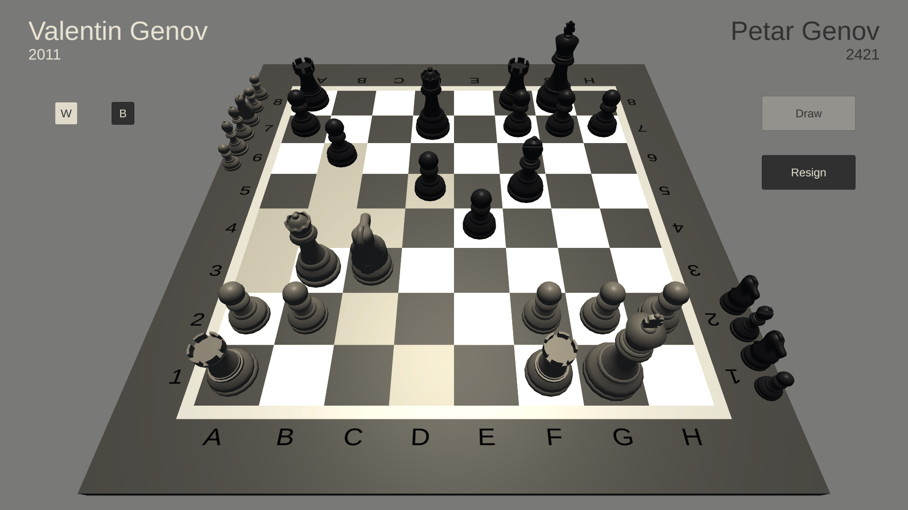
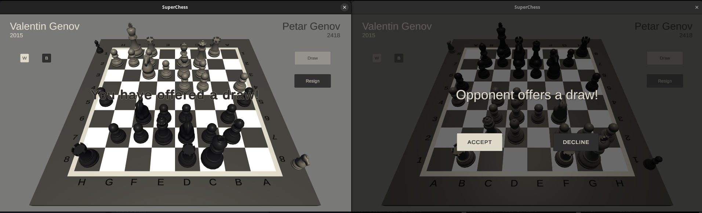
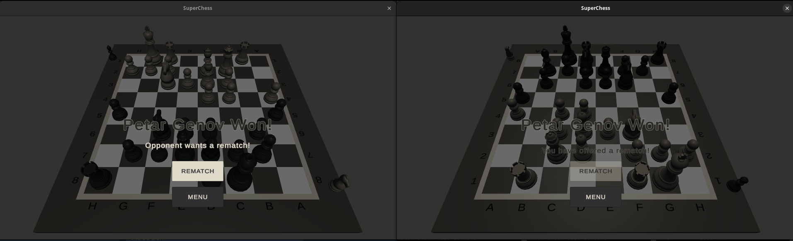
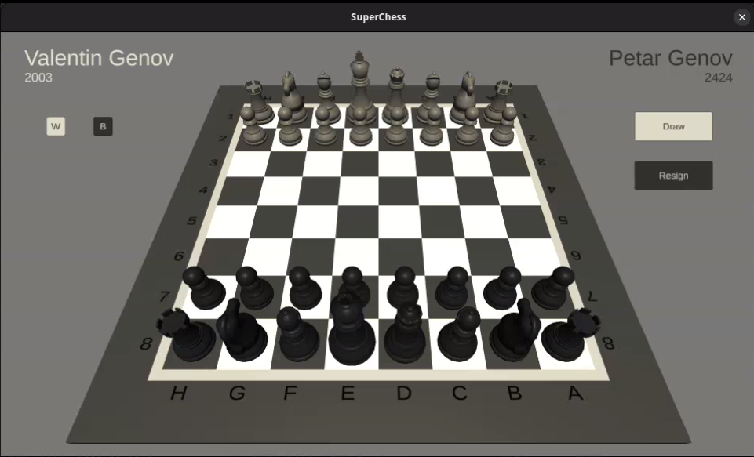
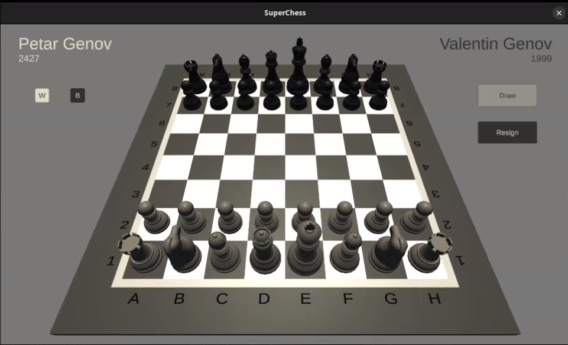
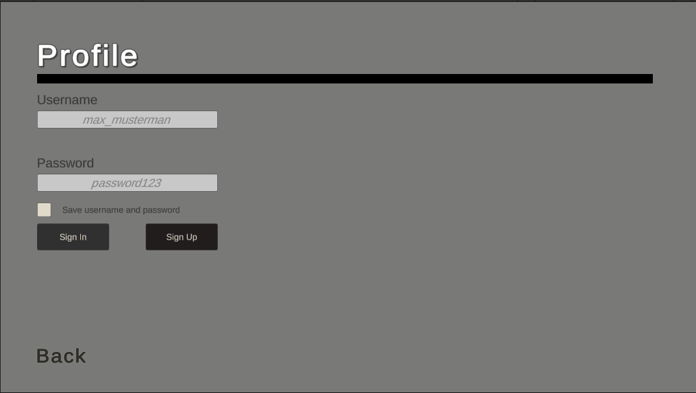
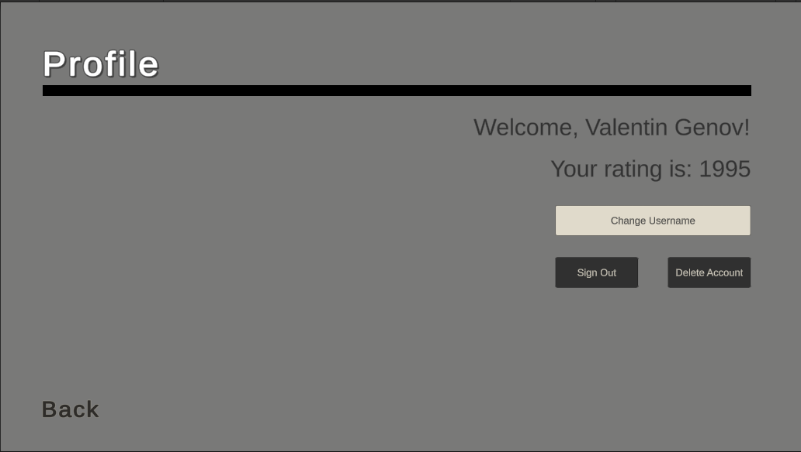

# SuperChess

A multiplayer chess game built in Unity, with a custom client–server
networking layer, user accounts and an ELO rating system.



*Online game, white's turn, highlighted are all possible moves with the queen.*

---

## Features

**Chess**

- Complete move generation per piece type, including castling, en passant
  and pawn promotion with a piece-selection dialog
- Checkmate, **stalemate** and **draw by insufficient material**
- **Draw offers follow the official procedure** - only the player who is not
  to move may offer a draw, mirroring the FIDE rule that a draw is offered
  after making your own move and before the opponent replies
- Captured pieces are scaled down and lined up along the board edge
- **The whole interface signals whose turn it is** - the thin rim around the
    playing surface turns cream for white and dark for black, and the button
    colour scheme shifts with it

**Online play**

- Client–server multiplayer over Unity Transport with a custom protocol of
  ten typed message classes (move, draw, decline, resign, rematch,
  keep-alive, welcome, start, opponent name, opponent rating)
- Resign, draw and rematch handling synchronised across both clients
- **Colours alternate on rematch** - players swap sides, and the name and
  rating displays follow them

**Accounts and ratings**

- Sign-up, sign-in, username change and account deletion, persisted in MongoDB
- **ELO ratings** recalculated after every game using the standard formula:
  the expected score is derived from the rating difference, with a K-factor
  of 40
- **Per-user settings** - volume preferences are stored with the account.
  Before signing in the app uses a default; on sign-in the saved preference
  is loaded and applied immediately

**Interaction**

- **Two ways to move** - click a piece and then its target square, which
  plays a movement animation, or drag the piece directly. Castling and
  captures animate the same way
- A move is cancelled by right-clicking, by clicking an illegal square, or by
  dragging the piece off the board; the piece returns to its origin
- Pieces cannot be selected or moved when it is not your turn
- The camera rotates onto the board when a game starts, and flips between
  white's and black's perspective as if the player changed seats
- Sound effects for moves, captures and UI interaction

---

## Screenshots

| Draw offer | Game over and rematch |
|---|---|
|  |  |

*Left: a draw offer as both clients see it - the offering player's own button
is disabled. Right: the result screen with a rematch offer.*

| Before | After the rematch |
|---|---|
|  |  |

*Ratings are recalculated after every game - Valentin 2003 → 1999,
Petar 2424 → 2427. On a rematch the players swap colours, and the name and
rating displays move with them.*

| Profile | Signed In |
|---|---|
|  |  |

*Left: the profile screen with options to sign in, sign up and save input for the next start of the game. Right: the account screen once signed in with options to change username, sign out and delete account.*

*The camera rotates onto the board when a game starts, and flips between white's and black's perspective as if the player changed seats.*


https://github.com/user-attachments/assets/35164e0f-0ea3-4e47-a2b2-fb6a0ac0543d


---

## Architecture

```
Assets/Scripts/
├── Pieces/           ChessPiece base class + Bishop, King, Knight, Pawn,
│                     Queen, Rook - each overriding GetSpecialMoves()
├── Net/              Client, Server, NetUtility
│   └── NetMessage/   Ten typed message classes
├── Account/          AccountHandler, LoginForm, MongoClientWrapper,
│                     RatingHandler, UserModel, EventBus
├── Board.cs          Tile logic
└── Chessboard.cs     Board state, turn handling, special-move resolution
```

Special moves are modelled through a `SpecialMove` enum and resolved
polymorphically - each piece decides for itself which special moves are
available in a given board state.

Sign-in and sign-out are published through a small `EventBus`, so components
such as the volume control and the rating handler react to authentication
without knowing anything about the login screen.

---

## Tech stack

Unity 2022.3.17f1 · C# · MongoDB · Docker · Unity Transport · URP

---

## Running it

Requires Unity 2022.3.17f1 and Docker.

```bash
docker compose up -d      # starts MongoDB on port 27018
```

Then open the project in Unity and load `Assets/Scenes/SampleScene.unity`.
The database is only needed for accounts and ratings - without it, signing in
will time out.

For an online game, run two instances: one hosts, the other connects to
`127.0.0.1`.

---

## Background

The initial version follows the
[Complete Chess Game Tutorial](https://www.youtube.com/playlist?list=PLmcbjnHce7SeAUFouc3X9zqXxiPbCz8Zp)
series by N3K Mercenary Camp (December 2022 – January 2023), which covers the
board, piece movement, the special moves and the client–server networking
layer.

Everything after that is my own work, developed over the following two years:
the missing endgame rules (stalemate, draw by insufficient material), draw and
resign handling, colour swapping on rematch, sound and settings, an
alternative click-to-play input mode, and a full account layer on top of
MongoDB with authentication and ELO ratings.

I also started breaking up the tutorial's monolithic `Chessboard` class into
separate components - a refactoring I did not finish. See below.

---

## Known limitations & what I'd change

- **`Chessboard.cs` is still around 2,400 lines.** I extracted the tile logic
  into `Board.cs` and pulled out sound, promotion and colour handling, but
  board state, rendering and rule resolution still live together. The next
  step would be separating rule evaluation from presentation.

- **The server does not validate moves.** It keeps no board state and simply
  relays `NetMakeMove` messages between clients. A modified client could send
  an illegal move, move out of turn, or claim the opponent's team. Legal-move
  highlighting exists on the client only, so it is UI guidance, not a security
  boundary. This comes from the tutorial's networking design; an authoritative
  server would hold the board and verify each move.

- **The client talks to MongoDB directly.** There is no service layer, so
  database access lives in the client and a player could in principle
  manipulate their own rating. This belongs behind an API.

- **Passwords are stored in plain text.** The field is called `shaPassword`,
  but no hashing ever happens - the value goes straight from the input field
  into the database, and `PlayerPrefs` keeps a plaintext copy on disk. This
  needs bcrypt or argon2, with verification moved to the server.

- **The rating calculation reads from the UI.** `RatingHandler` parses both
  players' ratings out of the on-screen text components and waits a fixed one
  second for them to appear, rather than reading from the data model. It
  works, but it is a layering violation with a timing assumption baked in.

- **The connection URI is hardcoded** in `MongoClientWrapper` - it should come
  from configuration.

Taken together, these come down to one thing: the client was trusted. Move
validation, database access and password checking all happen there. The right
cut would have been an authoritative server that owns the board and the data.
